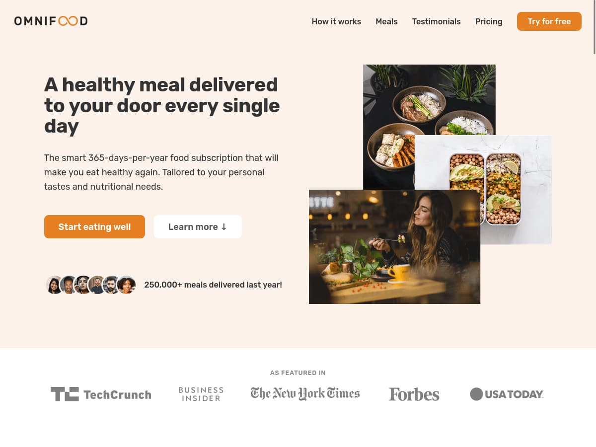

# Omnifood

[Omnifood](https://github.com/rolodoom/omnifood) is a one page site for a food app startup built following the code from [Build Responsive Real-World Websites with HTML and CSS](https://udemy.com/course/design-and-develop-a-killer-website-with-html5-and-css3) by [Jonas Schmedtmann](https://codingheroes.io/).

## Status

## Preview

**[View Live Preview](https://omnifood-rolodoom.netlify.app/)**

## Usage

### Basic Usage

After downloading, simply edit the HTML and CSS files included. These are the only files you need to worry about, you can ignore everything else! To preview the changes you make to the code, you can open the `index.html` file in your web browser.

### Advanced Usage

Clone the source files of the theme and navigate into the theme's root directory. Run `npm install` and then run `npm start` which will open up a preview of the template in your default browser, watch for changes to core template files, and live reload the browser when changes are saved. You can view the `package.json` file to see which scripts are included.

#### npm Scripts

- `npm run watch:sass` watch the `scss/main.scss` file and compile into `css/style.css`
- `npm run devserver` starts a simple development server.
- `npm start` or `npm run start` runs the project, launches a live preview in your default browser, and watches for changes made to files in `scss`

You must have npm installed in order to use this build environment.

## Bugs and Issues

Have a bug or an issue with this template? [Open a new issue](https://github.com/rolodoom/monifood/issues) here on GitHub.

## License

This code is released under the [GPL-3.0](https://raw.githubusercontent.com/rolodoom/omnifood/master/LICENSE) license, which means you have the four freedoms to run, study, share, and modify the software. Any derivative work must be distributed under the same or equivalent license terms.
